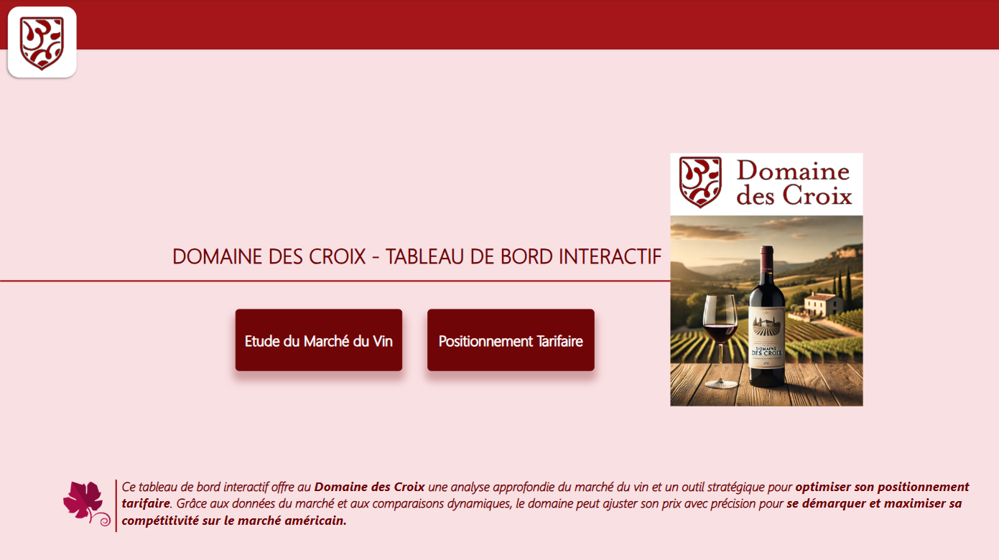
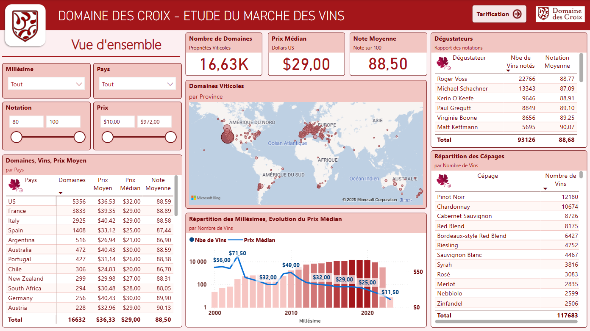
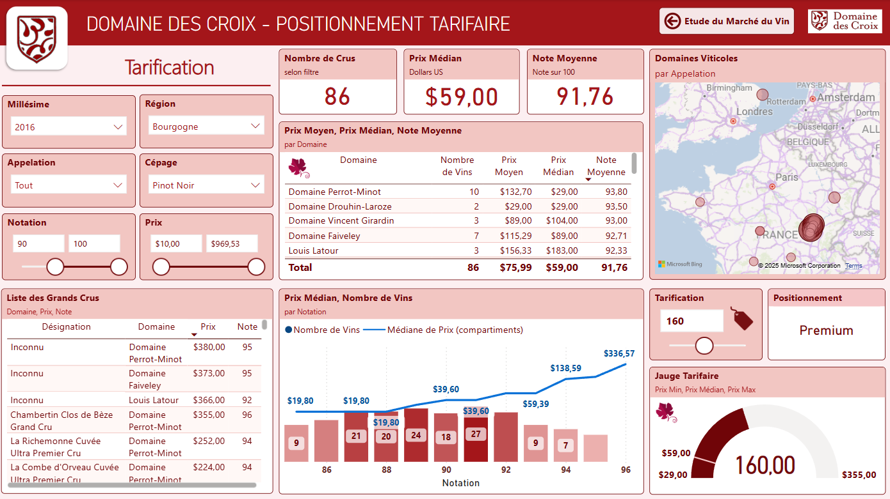

# 🍷 Étude de Marché - Domaine des Croix

  

  

  

## 📍 Contexte  
Le Domaine des Croix souhaite s'implanter sur le marché américain en proposant ses bouteilles de vin. Pour assurer un positionnement compétitif, une analyse approfondie du marché du vin aux États-Unis est nécessaire. Cette étude de cas vise à déterminer un prix optimal pour leurs produits en fonction des données du marché.

## 🎯 Objectifs

- Analyser la dynamique du marché du vin aux États-Unis.  
- Étudier les tendances de prix en fonction des cépages, des millésimes et des notes des œnologues.  
- Comparer les prix des vins similaires afin de positionner stratégiquement le Domaine des Croix.  
- Proposer une fourchette de prix adaptée à son positionnement (entrée de gamme, premium, haut de gamme).  

### Vue du Tableau de Bord

 

  

  

  

  

## 📊 Données Utilisées  
- **Dataset marché du vin** : Base de 130 000 vins incluant cépage, pays, région, millésime, notes d'œnologues et prix moyens en dollars.  
- **Données Domaine des Croix** : Caractéristiques de la bouteille du client pour la comparer avec le marché.

## 🔬 Méthodologie  
L'étude repose sur une analyse exploratoire des données (EDA), des visualisations interactives et des comparaisons détaillées :
1. **Analyse descriptive** : Tendances des prix, répartition par cépage, pays et région.  
2. **Analyse comparative** : Positionnement du Domaine des Croix face aux concurrents.  
3. **Recommandation de prix** : Proposition d'une fourchette de prix en fonction du segment de marché visé.

## 📌 Livrables et Déploiement
Les résultats seront présentés sous la forme d’un **tableau de bord dynamique** et d’un **rapport synthétique** permettant au client de comprendre les recommandations de prix.

- Un **notebook** présentant l'analyse exploratoire ([lien](./notebooks/Analyse%20Exploratoire.ipynb))  
- Un **tableau de bord interactif** intégrant des graphiques lisibles et accessibles. ([lien](./reports/Tableau%20de%20bord%20Etude%20des%20Vins%20Domaine%20des%20Croix.pdf))  
- Un **rapport d'analyse** expliquant la méthodologie et les résultats avec une **proposition de prix argumentée** pour le Domaine des Croix. ([lien](./reports/Présentation%20Etude-Prix-Vins.pdf))  

## 🛠️ Outils Utilisés  
- **Python (Pandas, Matplotlib, Plotly)** pour l'analyse des données.  
- **Power BI** pour les visualisations interactives.  
- **Jupyter Notebook** pour l'exploration initiale des données.  